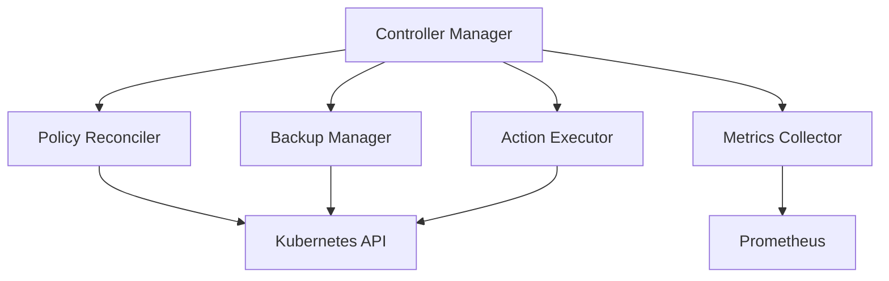
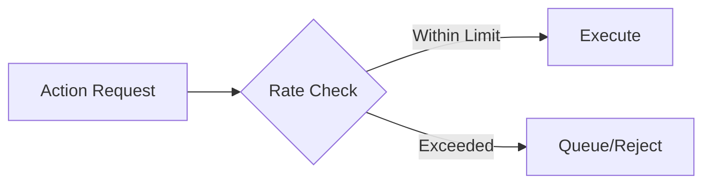
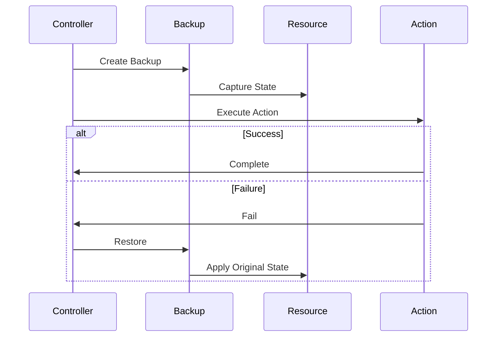
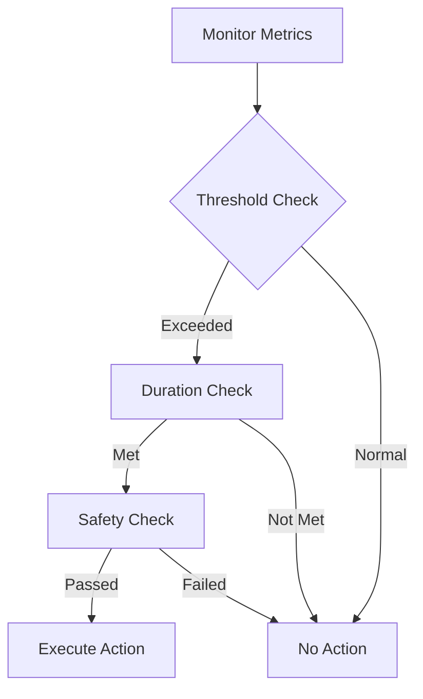
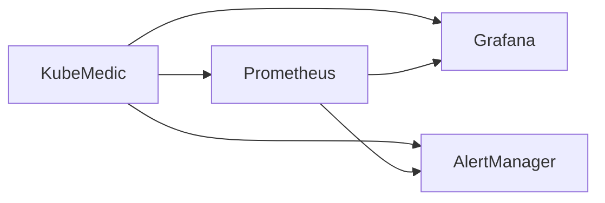
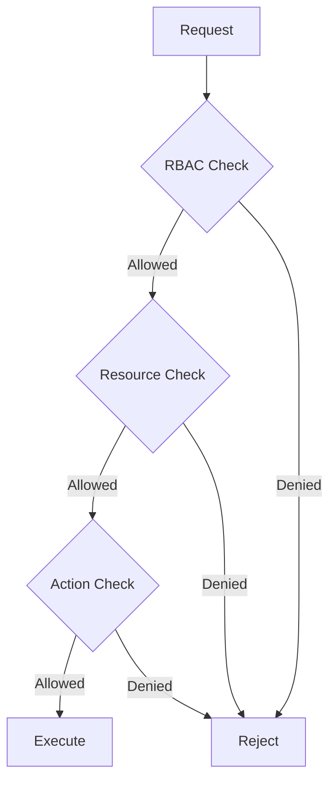

# KubeMedic Architecture

## Overview

KubeMedic is designed as a Kubernetes operator that provides autonomous remediation capabilities through a policy-driven approach. This document outlines the core architecture, components, and interactions within the system.

## Core Components

### 1. Controller Manager
The central component that orchestrates all remediation activities:
- Policy reconciliation
- State management
- Action coordination
- Backup handling
- Metric collection



### 2. Policy Engine
Handles policy evaluation and decision making:
- Condition monitoring
- Threshold evaluation
- Action scheduling
- Safety checks
- Rate limiting

### 3. Backup System
Manages state preservation and rollbacks:
- Pre-action state capture
- Backup storage
- Validation
- Rollback execution
- TTL management

### 4. Monitoring Integration
Provides observability and metrics:
- Prometheus metrics
- Grafana dashboards
- Alert rules
- Audit logging
- Performance metrics

## Safety Mechanisms

### 1. Rate Limiting


### 2. Resource Protection
- Namespace restrictions
- Resource quotas
- Action limitations
- Protected resources

### 3. Backup and Recovery


## Workflow

### 1. Policy Evaluation


### 2. Action Execution
1. Pre-flight checks
2. State backup
3. Action execution
4. Monitoring
5. Verification
6. Revert if needed

### 3. State Management
- Original state preservation
- Action history
- Audit trail
- Recovery points

## Integration Points

### 1. Kubernetes Integration
- Custom Resources
- RBAC
- Admission Webhooks
- API Extensions

### 2. Monitoring Stack


### 3. External Systems
- Webhooks
- Notification systems
- Logging systems
- Audit systems

## Failure Modes

### 1. Controller Failures
- Leader election
- State recovery
- Action cleanup
- Resource protection

### 2. Resource Failures
- Retry mechanisms
- Circuit breaking
- Fallback actions
- Safe defaults

### 3. Network Issues
- Timeout handling
- Retry logic
- Partial failure handling
- State reconciliation

## Performance Considerations

### 1. Resource Usage
- Controller resources
- Backup storage
- Metric collection
- Action overhead

### 2. Scalability
- Multi-cluster support
- Namespace distribution
- Action batching
- Resource pooling

### 3. Optimization
- Caching strategies
- Batch processing
- Resource limits
- Priority queues

## Security Model

### 1. Authentication
- Service accounts
- RBAC roles
- User permissions
- API access

### 2. Authorization


### 3. Audit
- Action logging
- State changes
- Access attempts
- Policy modifications

## Development Guidelines

### 1. Code Organization
```
/
├── api/
│   └── v1alpha1/
├── controllers/
├── pkg/
│   ├── backup/
│   ├── metrics/
│   └── actions/
└── tests/
    ├── e2e/
    └── integration/
```

### 2. Testing Strategy
- Unit tests
- Integration tests
- E2E tests
- Chaos tests
- Performance tests

### 3. Best Practices
- Error handling
- Resource cleanup
- State validation
- Documentation
- Security checks

## Deployment Model

### 1. Installation
- Helm charts
- Operator lifecycle
- CRD management
- RBAC setup

### 2. Configuration
- Values file
- Environment variables
- Secret management
- Policy templates

### 3. Upgrades
- Version compatibility
- State migration
- Backup preservation
- Rollback support 